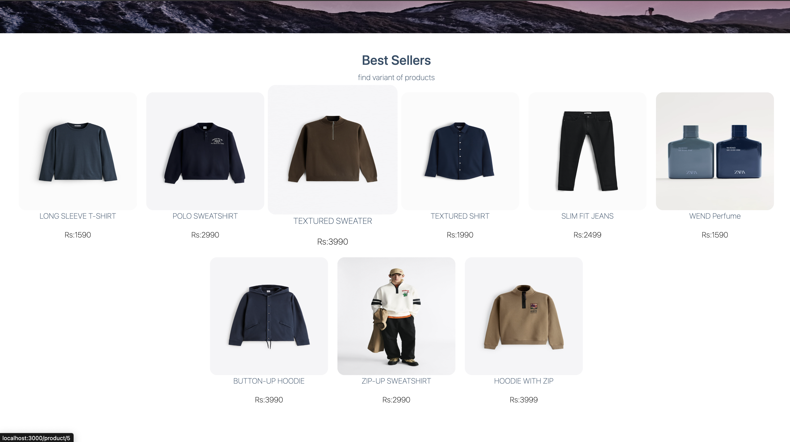
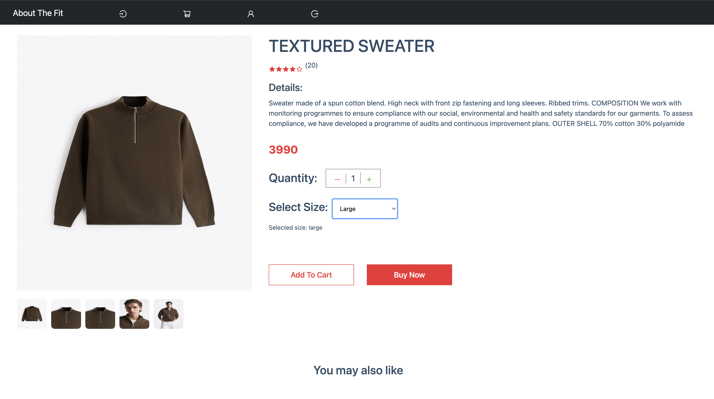
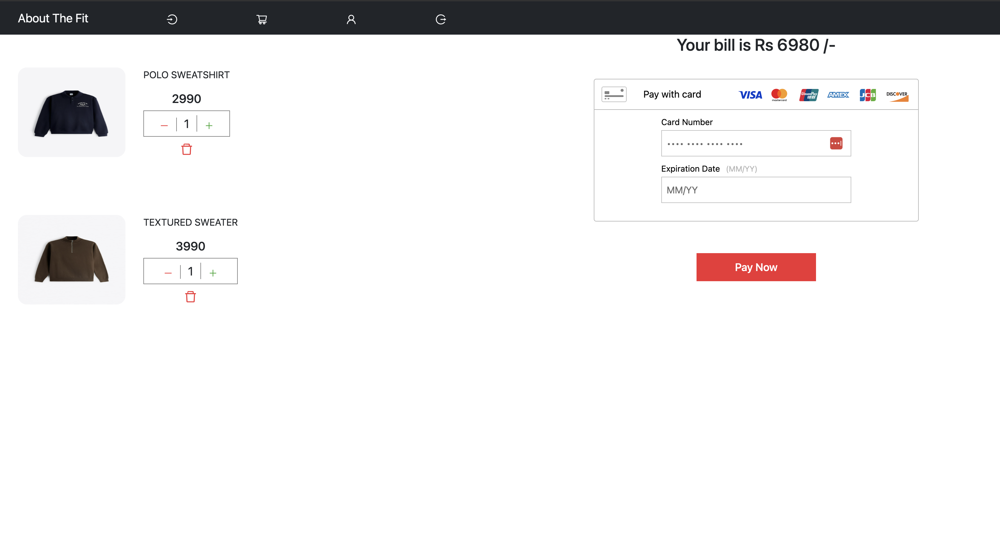

This is an ecommerce website with backend built in Django and frontend in react with braintree payment gateway integration.
It covers following technical topics in 1 app:-

1. Database modeling with `sqllite` (see `models.py`)
2. API to performance CRUD Operations on database and Custom User authentication with `Django-Rest-Framework` (see `views.py` and `serializer.py)
3. Payment Gateway Integration with  `Braintree`
4. Frontend consuming api with `React`


 
 

<a name="start-locally"></a>
## Start Project locally

Make sure you `cd` into the correct folder (with all app files) before following the setup steps.
Also, you need the latest version of [Python 3](https://www.python.org/downloads/)

To start and run the local development server,

1. Initialize and activate a virtualenv:
  ```bash
  $ pipenv shell
  ```

2. Install the dependencies:
```bash
$ pipenv install -r requirements.txt
```


3. Change database config so it can connect to your local sql database


4. Run the backend api  server:
  ```bash 
  $ python3 manage.py runserver
  ```
5. Run the front-end react app 
  ```bash 
  $ cd frontend 
  $ npm init 
  $npm run server 
  ```

## API Documentation
<a name="api"></a>

Here you can find all existing endpoints, which methods can be used, how to work with them & example responses you´ll get.


### Available Endpoints

Here is a short table about which ressources exist and which method you can use on them.

                          Allowed Methods
       Endpoints    |  GET |  POST |  DELETE | PATCH  |
                    |------|-------|---------|--------|
      /user         |  [Y] |  [Y]  |   [N]   |   [N]  |   
      /product      |  [Y] |  [Y]  |   [Y]   |   [Y]  |   
      /product/<id> |  [Y] |  [N]  |   [Y]   |   [N]  |   
      /order        |  [Y] |  [Y]  |   [N]   |   [N]  |   
      /category     |  [Y] |  [Y]  |   [N]   |   [N]  |   


 
